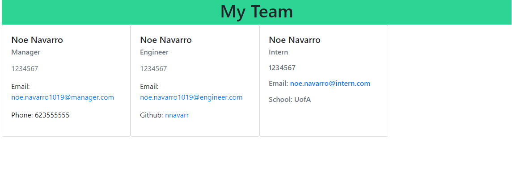

  

### Team Profile Generator

### Description
The team profile generator is a node based application that takes user input and generates an HTML webpage based on that input.

As of 1/16/2022, the synchronous run of inquirer is still being developed. However, the underlying functionality is working as intended.

### Usage
In its current state, please set the team members and roles within the index.js file.  From there, the HTML page will be written into the 'dist' directory.

### Usage Video
A video showcasing the functionality can be seen [here](https://watch.screencastify.com/v/XpTDBOyrhTAmb67FuuxE)
